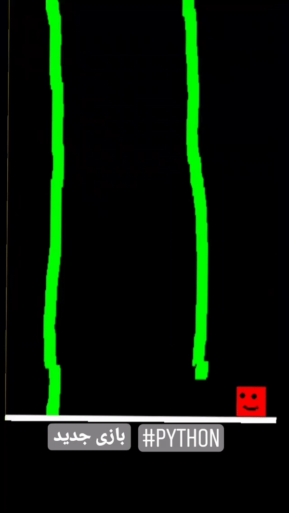

# BlockyBlockGame
This is a wonderful game just for learning and developing Python

I just wanted to learn Python and I found out Python is cool and easy :)

you can draw on screen by mouse and move the 'blocky charcter' via keyboard arrow keys.

download the source code and make fantastic forks.

by pygame

Pygame, the library is cross-platform and designed to make it easy to write multimedia software, such as games, in Python. Pygame requires the Python language and SDL multimedia library. It can also make use of several other popular libraries.

## How to Play
    ■ Welcome to Blocky Blocky (B.b)
    It is a fight between mouse cursor and Blocky Block !

    Use Arrow keys to move around, press [space bar] to jump
    Hit [Enter] to shot laser gun
    Press [+] and [-] keys to make the B.b bigger or smaller
    Finally, [click] anywhere of playground by Mouse to draw anything you like; B.B can move and jump over them

    ■ Other useful trick:
    C: Clear the playground
    G: Green brush
    R: Red brush

