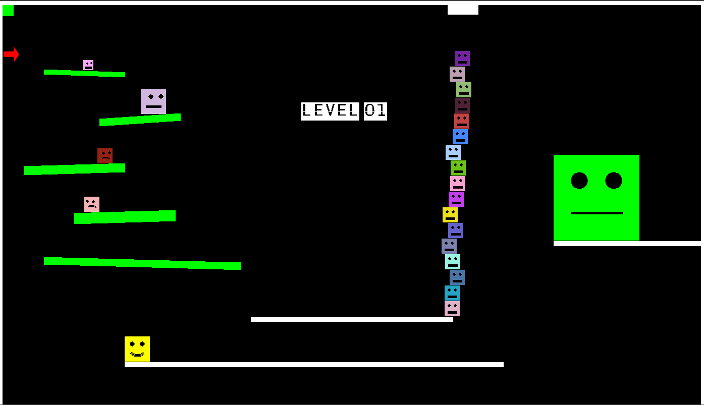

# BlockyBlockGame

I've just started coding and I found out python + pygame is so fun.   
It started by turning on a pixel on screen screen, then I made a character and tried to make it alive.  
This is BlockyBlock.  
Please download the source and make fantastic forks 🍴

## How to Install PyGame

install pygame:
``` shell
python -m pip install -U pygame --user
```
If it doest work you can download pygame and install it manually(whl file)

Download whl file [from here](https://www.lfd.uci.edu/~gohlke/pythonlibs/#pygame) then install it pip like this:
``` shell
pip install pygame‑1.9.2a0‑cp35‑none‑win32.whl
```


[ Read more ... ](https://kidscancode.org/blog/2015/09/pygame_install/)


## How to Play
    ■ Welcome to Blocky Blocky (B.b)
    Use Arrow keys to move around, press [space bar] to jump
    Hit [Enter] to shot laser gun
    [click] anywhere by Mouse to draw anything you like; B.B can move and jump over them
    press [tab] to generate random Blocky

## A preview of game


## Latest Updated
Object oriented version,  
Support multiplayer,  
### How To make <kbd>new Blocky</kbd> 
``` python
player1 = BlockyBlock(screen, "player1", x=10, y=10, color = YELLOW, size= Character_Size.Normal)
player1.assign_keystrock(STANDARD_INPUT)
player1.set_as_player1()
```




<span style="color:red">Happy Codding 🍓</span>

> Peyman Majidi 
