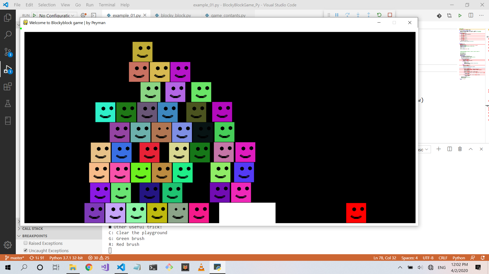
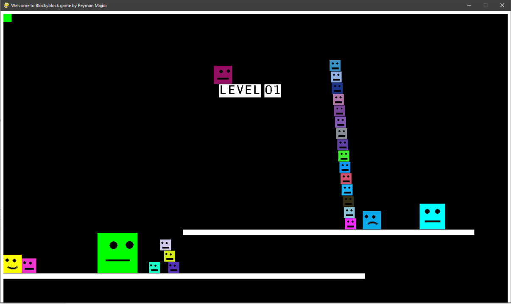

# BlockyBlockGame
Hello every one, I hope you doing good
Because I want to be more familiar with Python, I decided to make a game 
and the result is Blocky block.
I found out Python is cool and easy :)
In this game you can draw on screen by mouse and move the 'blocky' via keyboard'a [arrow keys] all over the screen.

Please download the source code and make fantastic forks 🍴

by pygame


## Intall PyGame

install pygame:
``` shell
python -m pip install -U pygame --user
```
If it doest wirk you can download pygame and install it manually

Download whl file [from here](https://www.lfd.uci.edu/~gohlke/pythonlibs/#pygame) then install it pip like this:
``` shell
pip install pygame‑1.9.2a0‑cp35‑none‑win32.whl
```


[ Read more ... ](https://kidscancode.org/blog/2015/09/pygame_install/)

Pygame, the library is cross-platform and designed to make it easy to write multimedia software, such as games, in Python. Pygame requires the Python language and SDL multimedia library. It can also make use of several other popular libraries.


## How to Play
    ■ Welcome to Blocky Blocky (B.b)
    It is a fight between mouse cursor and Blocky Block !

    Use Arrow keys to move around, press [space bar] to jump
    Hit [Enter] to shot laser gun
    Press [+] and [-] keys to make the B.b bigger or smaller
    Finally, [click] anywhere of playground by Mouse to draw anything you like; B.B can move and jump over them


    ■ Other useful trick:
    C: Clear the playground
    G: Green brush
    R: Red brush


## How To Generate New Blocky
``` python
player1 = BlockyBlock(screen, "player1", x=10, y=10, color = YELLOW, size= Character_Size.Normal)
player1.assign_keystrock(STANDARD_INPUT)
player1.set_as_player1()
```


## Updated
Support multiplayer

Generate new blocky - object oriented version

As you can see, you can generate unlimited BlockyBlock

and the "game over" feature added





<span style="color:red">Happy Codding 🍓</span>

> Peyman Majidi 
